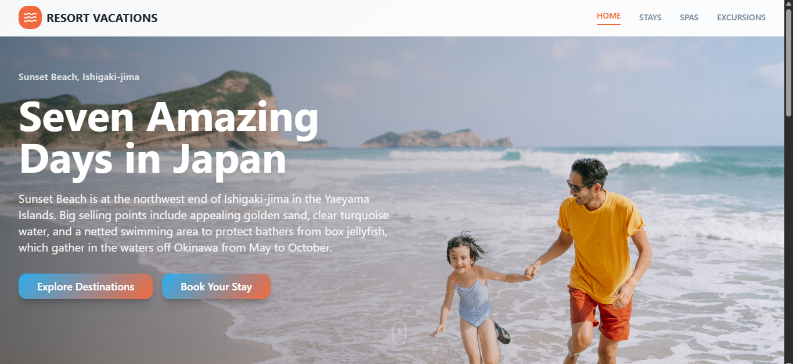

# Resort Vacations - Luxury Travel Experiences



## Project info

Follow these steps:

```sh
# Step 1: Clone the repository using the project's Git URL.
git clone <YOUR_GIT_URL>

# Step 2: Navigate to the project directory.
cd <YOUR_PROJECT_NAME>

# Step 3: Install the necessary dependencies.
npm i

# Step 4: Start the development server with auto-reloading and an instant preview.
npm run dev
```

This project is built with:

- Vite
- TypeScript
- React
- shadcn-ui
- Tailwind CSS

## How can I deploy this project?

You can deploy with platforms like Vercel, Netlify, or GitHub Pages. Configure build and output directories according to your toolchain (e.g., Vite uses `npm run build` and outputs to `dist`).

## Can I connect a custom domain?

Yes. Most hosts support custom domains via their dashboard (e.g., add your domain and update DNS records as instructed by your hosting provider).
